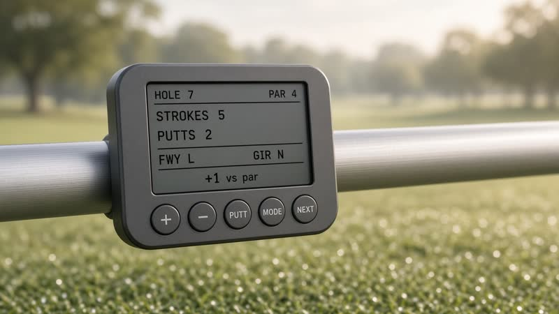
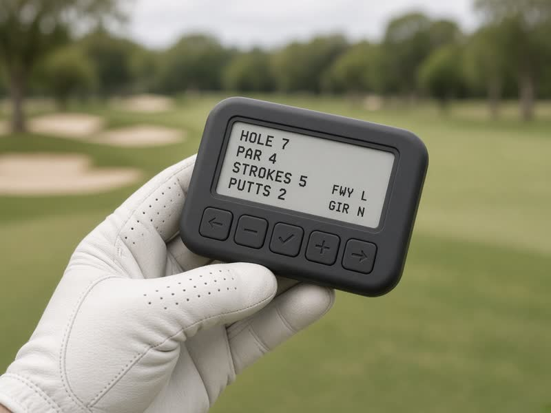
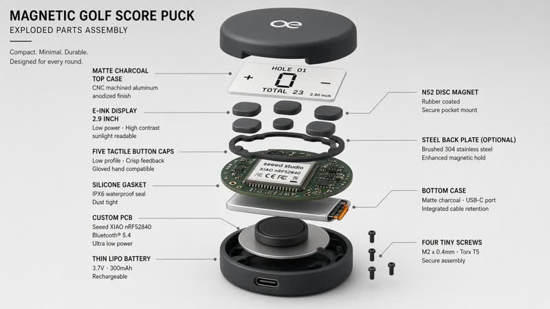
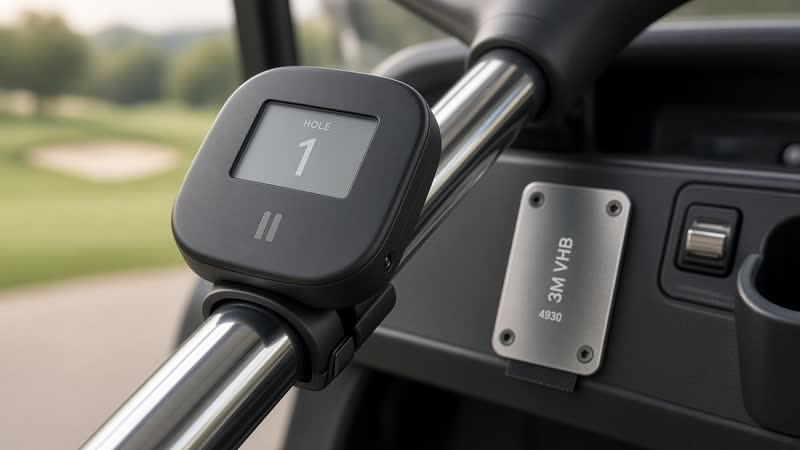
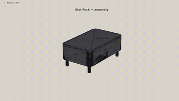

# Stat Puck

Magnetic golf-cart score puck — e-ink + 5 buttons, offline on-course, BLE sync after the round.

## Repo

**https://github.com/brianwhitet-ops/stat-puck**

Full design pack zip: [v0.1.0 release](https://github.com/brianwhitet-ops/stat-puck/releases/tag/v0.1.0) (`stat-puck-full.zip`)

## Concepts

| On cart | In hand | Exploded | Mount |
| --- | --- | --- | --- |
|  |  |  |  |

## Assembly animation



Full MP4 is in the [v0.1.0 release zip](https://github.com/brianwhitet-ops/stat-puck/releases/download/v0.1.0/stat-puck-full.zip).

## Deliverables

| Path | What |
| --- | --- |
| `site/` | Slab product site for playslabgolf.com. Preview: `npm run preview`. Do not deploy until Brian yes. |
| `design/concept-01/` | Locked Concept 01 hero plate |
| `design/instinct-firmware-goldens-pr1/` | Approved six-screen firmware goldens |
| `concepts/web/` | On-cart, in-hand, exploded, mount-on-bar concept images |
| `docs/SPEC.md` | One-page mechanical / electrical / firmware / cost spec |
| `docs/FIRMWARE_PLAN.md` | MVP tasks + 7-day bench plan |
| `docs/ORDER_MEMO.md` | What to order and why |
| `docs/RISKS.md` | Rental plastic, e-ink lag, bounce, NEXT, double-post, GHIN gate |
| `docs/SYNC_PAYLOAD.md` | Phone export schema (no invented GHIN API) |
| `bom/BOM.md` | Annotated BOM with vendor links + first-prototype cart |
| `cad/` | STEP + STL: enclosure, internals, steel plate, clamp |
| `docs/media/assembly-preview.gif` | Labeled assembly preview |
| `datasheets/` | Notes + linked vendor PDFs |
| `firmware/PINMAP.md` | Week-1 bring-up pin map |

## Device (P1)

- **MCU:** Seeed XIAO nRF52840 (USB-C, BLE) → production Raytac MDBT50Q-1MV2
- **Display:** Waveshare 2.9" e-Paper 296×128 (SPI)
- **Buttons:** 5× Omron B3W-1000 (IP67) — `+` `−` `PUTT` `MODE` `NEXT`
- **Magnet:** K&J DC6TP-N52 rubber-coated N52, **13.12 lb** Case-1 pull
- **Battery:** 500 mAh protected LiPo
- **Mount:** magnet pocket + steel plate/VHB for plastic carts + optional bar clamp

## UX (in-round)

```
HOLE 7  PAR 4
STROKES  5
PUTTS    2
FWY  L   GIR  N
+1
```

Defaults: strokes = par, putts = 2, GIR auto-suggest, FWY N/A on par 3. No rangefinder, no live GHIN, no on-device handicap.

## Regenerate CAD / animation

```bash
python3 cad/generate_enclosure.py
python3 animation/make_animation.py
```

## License

Prototype design files: MIT for CAD/firmware sketches. Vendor datasheets remain their respective copyrights.
