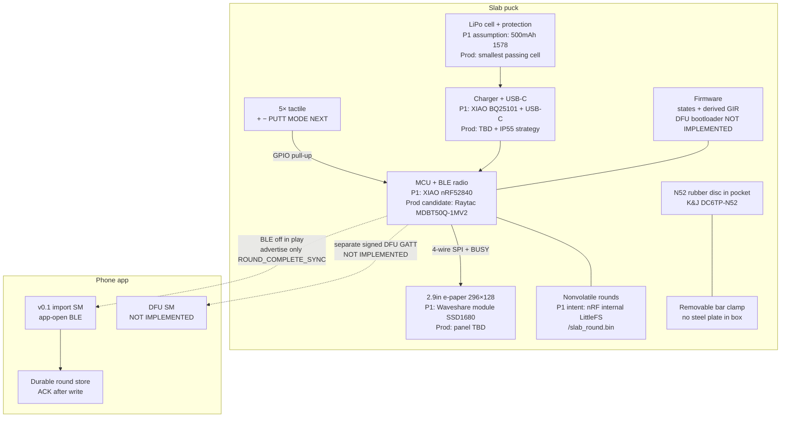

# System architecture (engineering input)

**Revision:** 2026-09-17  
**P1** = current bench modules. **Production** = candidates / TBD. Current work is input, not a frozen transfer.

No custom schematic or PCB exists. Host UI and `pio run` success are not hardware proof.

## 1. Block diagram



ASCII (same topology):

```
[5 buttons]--GPIO-->[ MCU+BLE ]--SPI-->[ e-paper ]
                       |    |
                       |    +-- LittleFS rounds
                       +-- [charger]--USB-C
                       +-- [LiPo + protect]
[N52 magnet pocket] + [removable clamp]     (no steel plate in box)

BLE (post-round only) --> [App import v0.1] --> durable ACK
BLE DFU GATT            --> NOT IMPLEMENTED
```

## 2. Interface table

| Block | P1 (bench) | Production candidate | Electrical / logical interface | Status |
| --- | --- | --- | --- | --- |
| MCU + BLE | Seeed XIAO nRF52840, DigiKey **102010448**, USB-C, UF2 | Raytac **MDBT50Q-1MV2** (nRF52840, 10.5×15.5×2.05 mm, VDD 1.7–5.5 V) | SWD for factory; BLE 5.x; app CPU + radio | P1 module **selected for bench**. Production module **candidate**. No antenna design. |
| E-paper | Waveshare 2.9" B/W 296×128 module; **SSD1680**; GxEPD2_290_T94_V2 / GDEM029T94 family | Bare panel + controller TBD (stay SSD1680 unless advised) | 4-wire SPI: DIN D10, SCK D8, CS D7, DC D6, RST D3, BUSY D1 (busy **high** on Waveshare module); VCC 3.3 V | P1 module **selected for bench**. Production panel **TBD**. No real-panel evidence. |
| Buttons | 5× Omron **B3W-1000** to GND, `INPUT_PULLUP` | Same family or sealed-cap equivalent remain candidates after IP55 DFM | + D2, − D4, PUTT D5 (**ignored** by sequential lock), MODE D0, NEXT D9; debounce **25 ms** | P1 switch **p1_selected**. Production **candidate** pending DFM, wet/glove, and IP55. **Not** an approved production switch. Cap/seal **TBD**. |
| Battery | Adafruit **1578** 3.7 V 500 mAh protected pouch, ~36×29×4.75 mm | Smallest protected cell that passes BAT-01 after measurement (150/200/250/300/500 compare) | JST-PH on XIAO battery pads; UV cutoff ~3.0 V (Adafruit note) | **Starting assumption, not a floor.** |
| Charger / protection | XIAO onboard **BQ25101** + cell PCM | Charger IC, path, and pack protection **TBD** (IP55 USB-C) | USB-C charge + data on P1 | Production architecture **TBD**. Charge time **TBD**. |
| NVM / rounds | Intent: Adafruit LittleFS `InternalFS` `/slab_round.bin`; host uses `firmware/testdata/nvram.bin` | Internal flash vs external; must hold open + queued rounds through DFU | Binary `slab_round_t` magic `SLB1` / version 1 | Host file I/O implemented. Device hooks exist. **Power-loss / queue evidence: none.** |
| USB-C | On XIAO; CAD cutout on short edge | Production connector + seal **TBD** | Charge + UF2 flash on P1. Not a DFU path for golfers. | Sealing **TBD**. |
| Firmware | PR #1 `e7f7ad79…`: UI SM, derived GIR, persist API, BLE advertise **stub** + JSON builder | Same product SM + **zero-start hole create** + real GATT + signed DFU | See `FIRMWARE-STATUS.md` | Demo boot `LOCAL EXAMPLE`. Inactive/start/course-card **not implemented**. Hole defaults **conflict** with ENT-01 (still par / 2 / fairway). OTA **NOT IMPLEMENTED**. |
| App import | PR #3 types/tests only; no BLE | Capacitor/native shell later | App-open; validate; idempotent `round_id`; ACK after durable write | Contract scaffold. **E2E not implemented.** |
| v0.1 BLE payload | PR #1 builds `stat-puck.round.v1` JSON **in RAM** (includes `gir`) | Must converge with PR #3 `schema_version: 1` | No GATT characteristics implemented; no checksum on PR #1 builder | **Schema tension** — see `PUCK-APP-CONTRACT-NOTES.md` |
| DFU / OTA | None | Separate versioned DFU service + bootloader | Must not reuse round payload as a blob | **NOT IMPLEMENTED** |
| Magnet | K&J **DC6TP-N52** in bottom pocket (Ø19.2 × 9.6 CAD pocket) | Same or advised equivalent remain candidates after retention/RF review | Mechanical only; **RF keep-out not modelled** | P1 selection and production **candidate** pending DFM, RF, and retention. **Not** an approved production magnet. Catalog pull 13.12 lb Case-1 ≠ cart test |
| Clamp | Printed `optional_clamp` concept, ~Ø25 mm bore | Production clamp **TBD** | Removable; mates to magnet pocket | Concept only. **No steel plate in box.** |
| Custom PCB | None (jumper / XIAO) | TBD multilayer + antenna + test points | — | **TBD** |

## 3. Pin map (P1 only)

From PR #1 `firmware/include/slab_board.h` / `firmware/PINMAP.md` at `e7f7ad79…` (supersedes `main` MODE-to-GIR text).

| Signal | XIAO | Notes |
| --- | --- | --- |
| EPD DIN / SCK / CS / DC / RST / BUSY | D10 / D8 / D7 / D6 / D3 / D1 | BUSY high = busy |
| + / − / PUTT / MODE / NEXT | D2 / D4 / D5 / D0 / D9 | PUTT ignored |
| Encoder A/B | unpopulated (−1) | Optional dial shares +/− path |

## 4. Firmware logical states (implemented in host/device C, not E2E)

`DEFAULT_HOLE` → `STROKE_EDIT` → `PUTTS_INPUT` → `END_HOLE_CONFIRM` → next hole or `ROUND_COMPLETE_SYNC` → `DERIVED_STATS`.

**Owner-approved captured-value rule:** a new hole starts at zero (no recorded strokes, putts, or drive). Course par may be displayed as metadata. It must not prefill captured performance. Advancing/finishing must not invent FIR / GIR / putt facts from untouched fields.

**Current implementation conflict:** `slab_hole_apply_defaults` still writes `strokes = par`, `putts = 2`, `fairway = SLAB_FWY_H` on par 4/5. `slab_round_init` sets `drive_sel = SLAB_FWY_H`. Keep that as firmware truth until the code changes. See `FIRMWARE-STATUS.md`.

`slab_ble_should_advertise` is true only in `ROUND_COMPLETE_SYNC`. `main.cpp` prints a Serial stub; it does **not** start Bluefruit advertising or GATT.

GIR: `slab_hole_gir` = `(strokes − putts) ≤ (par − 2)`. Never prompted. Must run only on **captured** strokes/putts. On current firmware a locked untouched par-4 (`strokes=par`, `putts=2`) yields GIR **true** and FIR **true** — that is the STAT-01 failure.

## 5. Power domains (qualitative — no amps)

| State | Radio | Display | Intent |
| --- | --- | --- | --- |
| Active round | Off | Refresh only; hold ≈ 0 | MCU + input + NVM + regulator |
| Sleep | Off | Image retained | Target I_sleep after measurement |
| Sync | On ≤5 min / round | Status frame | I_sync after measurement |
| DFU | On | Progress (required product) | **Not implemented** |

Do not design to the old 5 mA / 100 µA / 8 mA ceilings; those were acceptance **illustrations**. Measure subsystems.

## 6. What Peakingtech should treat as open

- Custom PCB, antenna, charger, protection, and USB-C IP55 path
- Production panel vs Waveshare module
- NVM sizing for ≥10 rounds + DFU image banks
- Dual-bank vs recovery bootloader (ask **f**)
- Payload schema unification
- Firmware hole-create defaults still conflict with owner-approved zero-start (ENT-01 / STAT-01)
